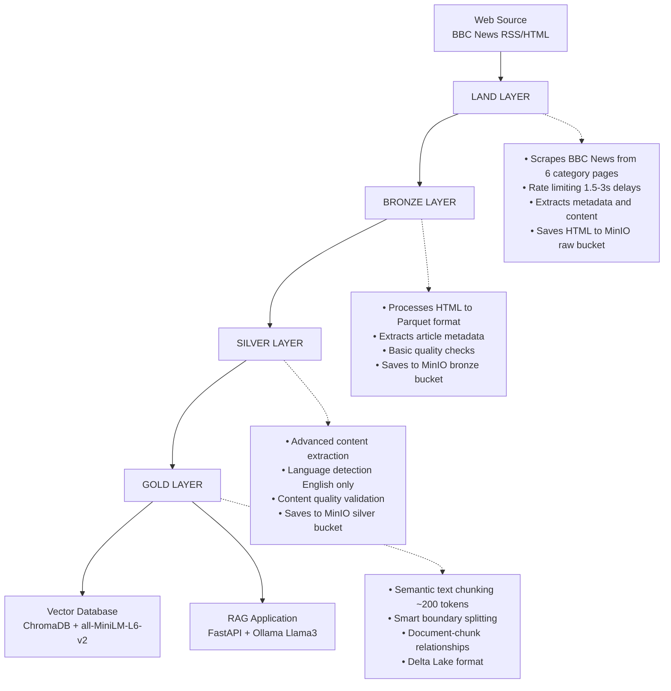

# Automated-Unified-Retrieval-Architecture---Python-WebScraping-and-ETL-Pipeline:

This project is an end-to-end data pipeline for scraping BBC News articles, transforming data through a medallion architecture (Land/Bronze/Silver/Gold), and enabling intelligent question-answering via RAG (Retrieval Augmented Generation). The system uses rate-limited web scraping, progressive data quality validation, semantic text chunking, and stores embeddings in ChromaDB with all-MiniLM-L6-v2. It serves responses through a FastAPI application powered by Ollama Llama3, with the entire pipeline containerized in Docker, orchestrated by Airflow, and utilizing MinIO storage with Delta Lake and DuckDB for efficient data management.

## LAND LAYER (Raw Data Collection)
- Scrapes BBC News articles from multiple categories (world, uk, business, technology, health, science)
- Respects robots.txt and implements rate limiting (1.5-3 second delays)
- Extracts structured content (title, author, date, summary, category, content)
- Saves raw HTML with embedded metadata to MinIO storage
- Implements session management with proper headers and error handling
- Performs initial URL validation and deduplication

## BRONZE LAYER (Structured Raw Data)
- Combines HTML content with extracted JSON metadata
- Converts raw HTML files to structured Parquet format
- Performs basic validation and parsing error detection
- Extracts article metadata (title, author, published date, description, URL)
- Implements file size tracking and ingestion timestamps
- Runs initial data quality checks (missing body detection)

## SILVER LAYER (Cleaned & Normalized Data)
- Advanced content processing with multi-strategy text extraction
- Language detection and filtering (English articles only)
- Content quality filtering (word count, title relevance, date validation)
- Text normalization and HTML tag removal
- Enhanced deduplication using content hashing
- Feature extraction (word count, reading time, topic classification)
- Delta Lake format storage with comprehensive QC reporting

## GOLD LAYER (Embedding-Ready Data)
- Semantic text chunking optimized for embedding models (~200 tokens per chunk)
- Document-chunk relationship maintenance with unique IDs
- Intelligent chunk splitting at paragraph and sentence boundaries
- Content feature analysis (numbers, quotes, questions detection)
- Chunk validation and quality scoring
- Delta Lake format with metadata preservation for RAG applications
<br><br><br>
## Architecture:

<br>

## SETUP:
1. Fill your own values in ```.env.examples``` and save as ```.env```.
2. Install ```requirements.txt``` for dependencies.
3. Search for you own sites for scraping, don't forget to respect robots.txt and rate limiting.
4. Manage Permissions and use docker compose to start the stack:
    ```
   docker-compose up --build
    ```
6. Access MinIO at port ```9001```. (user, pw: minioadmin)
7. Access Airflow at port ```8080```. (user, pw : airflow)
8. Rag Query at port ```8000```.
  
<br>

## PIPELINE INFRASTRUCTURE:
- Airflow: Orchestrates ETL via bbc_scraper_etl_pipeline DAG
  ● Includes retry mechanisms and failure-triggered email alerts
- MinIO: S3-compatible object storage across medallion architecture buckets
  ● Organized into raw, bronze, silver, gold, and chroma layers
- DuckDB: Lightweight in-process SQL engine for data transformations
  ● Handles fast SQL operations and data quality filtering
- Delta Lake: ACID-compliant storage for the gold layer
  ● Supports versioned data and metadata lineage
- ChromaDB: Persistent vector database for storing semantic embeddings
  ● Handles batch embedding updates and fast similarity search

## API & RAG: 
- FastAPI Service: Hosts dual endpoints
  ● /ask: RAG-based question answering with LLM
  ● /search: Embedding-based similarity search
- Vector Retrieval: Uses ChromaDB with all-MiniLM-L6-v2 for chunk-level semantic matching
- LLM Integration: Connects to Ollama's LLaMA3 for answer generation
  ● Supports configurable temperature for response diversity
- Documentation UI: Swagger UI hosted at root
  ● Includes real-time health check and usage statistics
- Resilient Design: Supports both local and remote ChromaDB fallback

<br>

## Here are some images of my work:   
    https://drive.google.com/drive/folders/1wbPf3PpiGhphHlHl4_HRvX03arhZF6ce?usp=sharing

